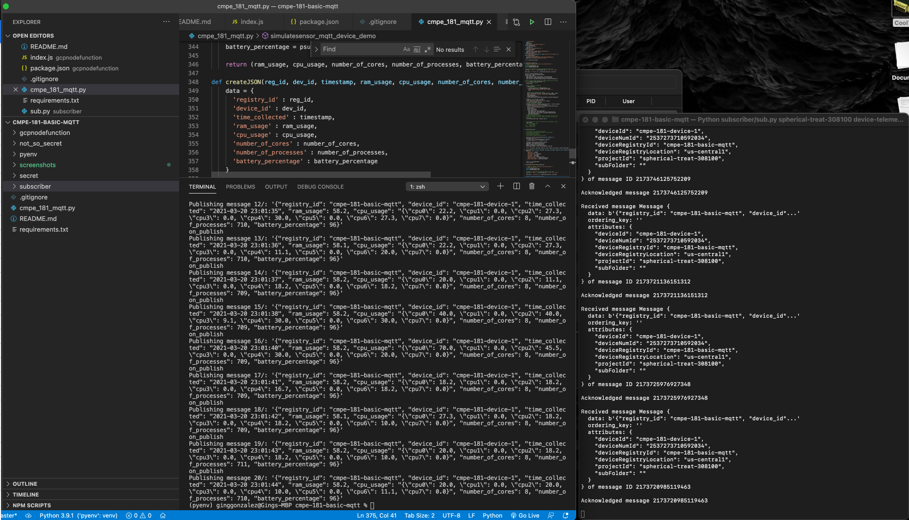
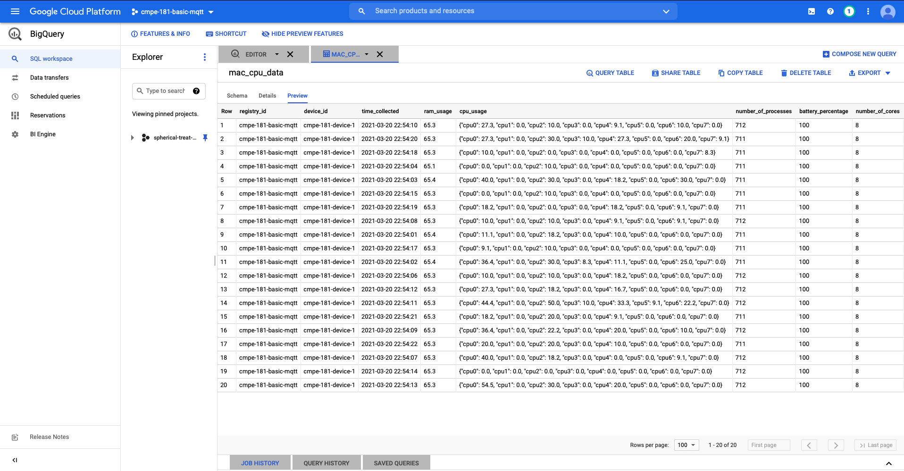
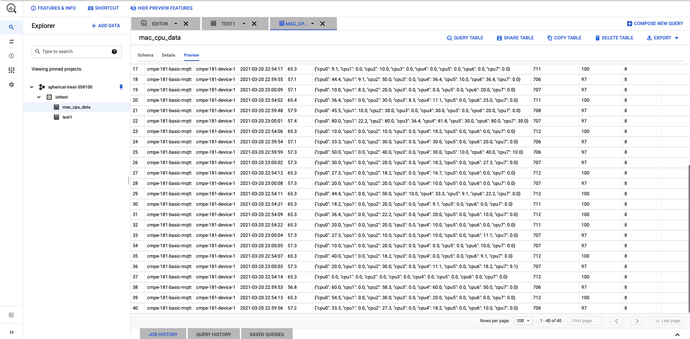

## Initial Setup
First step is to create a project and enable Cloud IoT Core and Cloud Pub/Sub APIs through the following link: 
https://console.cloud.google.com/flows/enableapi?apiid=cloudiot.googleapis.com,pubsub&_ga=2.42615333.-1267971805.1554925613

In the Google Cloud Platform, open menu bar on the top left and look for "IoT Core" and "Pub/Sub". Pin them if you prefer.

1. In IoT Core, create a registry.
2. Create a device.
3. Create key pair.

`openssl req -x509 -newkey rsa:2048 -keyout rsa_private.pem -nodes -out rsa_cert.pem -subj "/CN=unused" -days 365`

4. Upload Public Key (rsa_cert.pem) to Google
5. Set up authentication -- name the downloaded .json file as "google-secret.json". Store that under the "secret" folder.
https://cloud.google.com/storage/docs/reference/libraries#cloud-console

## Running with python3

1. `python3 -m pip install --user virtualenv`
2. `python3 -m venv pyenv`
3. `source pyenv/bin/activate`
4. `pip install -r requirements.txt`
5. `export GOOGLE_APPLICATION_CREDENTIALS="./secret/google-secret.json"`
6. Download roots.pem from here: https://pki.google.com/roots.pem, save that in the "not_so_secret" folder as "roots.pem"
7. Create Subscription: 

`gcloud pubsub subscriptions create projects/spherical-treat-308100/subscriptions/device-telemetry-sub --topic=projects/spherical-treat-308100/topics/device-telemetry`

Note: "spherical-treat-308100" is my project id. This should be replaced by yours.

8. Create Cloud Function: Upload `gcpnodefunction/index.js` while creating a function. Also upload `gcpnodefunction/package.json`

Note: Publisher and Subscriber should be running in separate terminals

9. Run the publisher: `python3 cmpe_181_mqtt.py`
10. Run the subscriber: `python3 subscriber/sub.py spherical-treat-308100 device-telemetry-sub`

## Relevant Screenshots (Other screenshots are in the "screenshots" folder)
1. PubSub Terminals

2. BigQuery "mac_cpu_data" table

